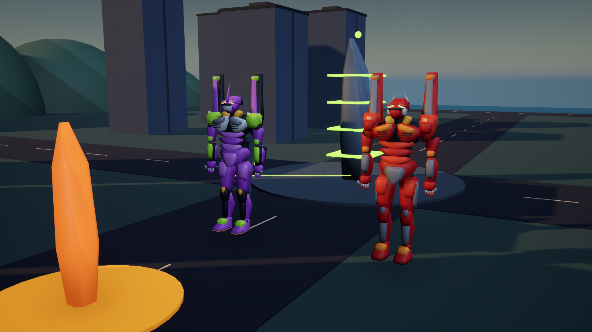

# EVA // LAST SIGNAL

A native Unreal Engine 5.7 single-player prototype with free exploration, an optional story chapter, and a separate Third Impact cinematic. Play Shinji's arrival in Tokyo-3, meet Misato, enter the hangar, deploy Unit-01, fight a humanoid Sachiel, and reach the hospital aftermath. Original procedural placeholder art and synthesized effects; no extracted anime models, music, or voice assets.



[Cockpit preview](Docs/Screenshots/EntryPlug08.png) · [Asuka call preview](Docs/Screenshots/AsukaCall.png) · [Verified features and limitations](VERIFICATION.md) · [Recommended development roadmap](ROADMAP.md)

This repository contains the Unreal project, C++ source, authored assets, asset generators, launchers, and build scripts. Packaged executables, Unreal Engine, compiler tools, caches, and local save files are excluded. A fresh clone must be built and packaged before the one-click launchers work.

## v0.8: Unit-01, Unit-02, and pilot communications

- **Unit-01:** rebuilt around the supplied purple reference, with a narrower waist, split pale breastplate, segmented abdomen, long legs, tall black shoulder pylons, green accents, and a horned helmet.
- **Unit-02:** Asuka's red companion joins free-roam deployment automatically. She follows your flank, steers around nearby cover, dodges incoming threats, and fires at Angels. Her distinct red armor, broad shoulders, white cheek plates, four optics, and orange details follow the second supplied reference.
- **Y / call Asuka:** opens a keyboard chat and quick-order window. Type a message and press Enter, or click an order. Escape or End Call hangs up. Gameplay pauses while typing, and the previous pause state is restored afterward. The last six exchanges stay in the current session.
- **Orders:** "follow me" provides moving support; "hold here" stops movement and fire except evasive movement; "cover me" or "attack" advances to firing range; "regroup" returns to you without firing. "Status", "Are you okay?", and "What is the plan?" use current unit integrity, player reserve, and Angel type.
- **Offline dialogue:** authored, context-aware responses with a local intent matcher. No internet connection, account, API key, voice cloning, or cloud language model is required. It supports the listed topics and commands rather than unrestricted generative conversation.
- **V / entry plug:** an elliptical illuminated pressure ring, open panoramic view, compact displays, control grips, pilot gloves, and a dedicated minimal cockpit HUD replace the old blocky frame. The center stays clear while aiming.

Unit-02's integrity is separate from yours. A green service pylon repairs both units. Companion kills complete the active contract and save it normally. Unit-02 is available in free roam; the first-encounter story and Third Impact remain separate modes.

## v0.7: mobility, cockpit, and Ramiel

Press **F1** for the in-game pilot training menu. It pauses the simulation and lists the main gameplay controls. **Space now jumps; Left Ctrl dashes.**

- **Movement:** responsive acceleration with frame-independent integration, 38 m/s sprinting, a powered jump with roughly 10 m of vertical rise, two directional dash charges, airborne dashes, and collision-based landings. Dashes preserve momentum and recharge one charge every 1.4 seconds. Knee flex, torso lean, and landing feedback give movement weight.
- **Cockpit:** **V** switches between external and entry-plug views with interior ribs, controls, and LCL instrumentation. **B** switches the external camera shoulder.
- **Shooting:** hold fire through reloads to resume automatically; an empty magazine starts a reload while fire is held. Reloads take 1.3 seconds. Drawing the knife takes 0.45 seconds.
- **Ramiel:** the Industrial district now hosts the blue crystal Angel. Evade after its beam locks, use buildings as cover, then shoot the core when the crystal opens. At half health it charges faster and fires three beams. **Play Ramiel.cmd** launches this encounter directly.
- **Presentation and rendering:** atmospheric daylight, clearer armor surfaces, a refined closed jaw, reusable shot effects and materials, and fewer redundant camera-occlusion updates.

## Play

Double-click **Play EVA**, **Play.cmd**, or **Play Free Roam.cmd** to enter free exploration directly. Press **Home** for the title screen. From the title, press **O** for free roam, **Enter** for the story, **Space** for battle practice, or **T** for Third Impact.

Double-click **Play Shamshel.cmd** to deploy directly into the new Harbor encounter. In free roam, select Harbor with **N**, travel to its amber beacon, and press **E**.

The standalone executable is `Builds/Windows/Eva.exe`. Playing the packaged game does not require Unreal Editor or an Unreal Engine installation. Keep the entire `Builds/Windows` folder together when moving or copying the game. A Windows PC with DX12-compatible graphics is required.

| Input | Action |
| --- | --- |
| WASD | Move relative to camera; slide along blocking geometry |
| Left Shift | Sprint, consuming extra reserve |
| Space | Powered jump, consuming five reserve seconds |
| Left Ctrl | Directional dash; two charges, two reserve seconds each |
| V / B | Entry-plug or external view / swap external camera shoulder |
| F1 | Controls and pilot training menu; pauses simulation |
| Y | Call Asuka in free roam; type and press Enter; Escape ends the call |
| M / N | Free-roam map / cycle district waypoint |
| Home | Return to title |
| Mouse | Orbit camera |
| Tab | Toggle optional aim assist; manual aim is the free-roam default |
| Hold left mouse | Fire the cannon at the crosshair, or chain knife strikes |
| Hold right mouse | Shoulder aim with reduced sensitivity and tighter camera |
| Hold / release middle mouse | Charge and fire the cannon; two seconds for full charge |
| Z | Synchronization overdrive: 80 sync required, +60% damage for eight seconds |
| X | Anti-A.T. pulse: neutralize barrier within 32 metres |
| F or 1 | Draw / stow the progressive knife from the shoulder compartment |
| 2 | Equip the cannon after retrieving it |
| Q, held | Directional field defense; consumes extra reserve and power per block |
| E | Use telephone/car, open armory, retrieve or reload cannon, connect to nearby charger |
| C | Release power cable |
| Escape | Pause |
| Enter | Begin chapter, advance dialogue, resume, return to title after completion |
| R | Reload during play; redeploy after defeat or while paused |
| Alt+F4 | Exit |

At street level, follow the cyan marker to the telephone, press E, then reach Misato's car and press E. Advance hangar and hospital dialogue with Enter. Cockpit entry and launch run automatically. In battle, breach Sachiel's field, then attack its core. The field regenerates after 11 seconds. Red ground zones mark incoming strikes; move clear, evade, or face Sachiel and hold Q. Sufficient core damage triggers signal loss, Unit-01's autonomous counterattack, and the hospital ending.

## Free-roam world

Explore a connected area approximately 810 by 810 metres across four districts: Central, Harbor, Upland, and Industrial. The city is fictional; this implements free exploration without a fixed story, rather than a geographical reconstruction of a real place.

- Green service pylons restore integrity, ammunition, and power when you press **E** nearby.
- Amber beacons start optional, repeatable Angel encounters. Defeating the Angel returns you to exploration; withdrawing beyond 250 metres from the encounter district disengages it.
- **M** opens the live map; **N** cycles destination markers. **Shift** sprints. The map suppresses movement but does not pause an active encounter.
- District discovery and completed-contract totals save automatically to Unreal's `EvaFreeRoam` save slot. Position, damage, and ammunition are reset at Central on a new deployment. **R** redeploys after defeat or from pause.
- Exploration uses one quarter of normal idle battery drain. Combat uses normal reserve drain. Sprinting adds 1.5 reserve seconds per second.

Unit-01 and Unit-02 use dedicated authored armor meshes with tapered plates, shoulder pylons, chest vents, jaw details, layered knee armor, finger plates, and shoulder identification. Brighter fill lighting and separate armor roughness make the purple panels visible in shadow. Nearby buildings obstructing the player view are temporarily hidden. Camera and muzzle traces prevent shooting through cover; misses and blocked player shots consume ammunition. Uninterrupted knife strikes chain into a stronger third hit.

## Shamshel and shooter controls

Harbor now hosts a repeatable Shamshel-inspired encounter: a hovering red segmented body, pale head, glowing core, and two animated energy whips. Central and Upland retain Sachiel; Industrial hosts Ramiel.

- The circular sweep warning locks onto your position; leave its radius, dash at impact, or jump over it. A sufficiently high jump also avoids Sachiel's ground strikes.
- Twin thrusts mark two narrow lanes; sidestep them. Guard works when facing the Angel.
- Each strike exposes the core for four seconds. Below half health, windups shorten and the counterattack window becomes 2.8 seconds.
- Defeating Shamshel records a contract and returns to free roam. The encounter remains tied to Harbor even when you change your navigation waypoint.

Cannon shots follow the crosshair, with camera and muzzle obstruction checks. Exposed-core hits deal full damage; body hits deal 65%. Hold left mouse for one shot every 0.55 seconds. Right mouse zooms the current view, movement accelerates and decelerates smoothly, and recoil and hit markers provide feedback. The cannon holds eight shells with 24 in reserve; **R** reloads in 1.3 seconds. Switching to the knife cancels a reload. Service stations replenish reserves. These are component animations and simplified hit volumes, pending human playtesting and production animation.

## Third Impact cinematic

Double-click **Play Third Impact.cmd**, or press **T** at the title screen. This separate one-minute sequence depicts Unit-02's defeat beneath nine winged Mass Production Evas, Shinji's berserk awakening, figures dissolving into orange light, and a rising LCL ocean. The defeat is implied through the surrounding flock; no graphic injuries are shown. This is a condensed fan interpretation using procedural models, captions, and synthesized sounds.

**Escape** pauses, **Enter** returns to the title (or resumes while paused), and **R** replays while paused or after the sequence finishes. The final ocean view remains on screen until you leave. The original first-encounter chapter remains available.

Run `Scripts/VerifyImpact.ps1` after packaging to capture and verify all four stages and replay reset. Captures are in `Builds/Windows/Eva/Saved/Screenshots/Impact_00.png` through `Impact_03.png`.

## Cannon, knife, and chargers

- **Armory 07 (amber marker):** approach the front and press E. Two armored panels slide apart and an elevator raises a heavy cannon. Press E again when the rack is ready to pull it into the Eva's hand. You receive eight loaded shells and 24 in reserve. Return and press E to resupply.
- **Heavy cannon:** three shots breach a full field. Each shot costs one shell and three battery seconds. Exposed-core damage is 145 per shell.
- **Progressive knife:** press F to open the shoulder compartment and draw the blade. Four strikes breach a full field. Exposed-core damage is 85 per strike; each costs 1.2 battery seconds. It remains usable without ammunition. The cannon is holstered on the back while using the knife.
- **Green power stations:** there are two. Approach within 13 metres and press E to attach the umbilical. Recharge is visible on the reserve meter. Press C to release it; exceeding the tether length disconnects automatically.

Deployment starts with 65 reserve seconds, so connect to the nearby station first. Maximum reserve is 120 seconds. The tether warns at 85% of its 62-metre reach. Staying beyond that reach for two seconds disconnects it; retreating resets the grace period. Disconnected reserve drains at one second per second, faster while shielding. Losing all integrity or reserve ends the mission; R retries from deployment. Structures caught in enemy strikes collapse into rubble; chapter results report city losses.

## Synchronization and anime presentation

**Z** activates eight seconds of overdrive at 80 sync: +60% core damage, 20 sync and eight power spent, extra battery drain, 24-second cooldown. **X** neutralizes an active enemy field within 32 metres for eight seconds: 25 sync and 12 power spent, 18-second cooldown. Successful attacks rebuild sync.

Hold **middle mouse** for up to two seconds to charge the cannon. Full charge costs one shell and eight power, breaches a full barrier, or deals 319 damage to an exposed core. Left mouse fires a normal shot. The HUD displays capacitor charge, magazine/reserve counts, reload progress, synchronization, cooldowns, and cable tension. Red emergency plates and stepped surface shading provide the anime presentation.

Details and tradeoffs: [Gameplay and style pass](Story/Gameplay-Style-Pass.md).

## Build and test

For a fresh checkout on Windows, install Unreal Engine 5.7, Visual Studio 2022 with the C++ game-development tools and Windows SDK, and Python 3 available as `python` on PATH. The scripts default to `C:\Program Files\Epic Games\UE_5.7`.

```powershell
git clone https://github.com/WeiberNoname/EvangelionUnits-V2.git
cd EvangelionUnits-V2
powershell -NoProfile -ExecutionPolicy Bypass -File .\Scripts\Build.ps1
powershell -NoProfile -ExecutionPolicy Bypass -File .\Scripts\Package.ps1
.\Play.cmd
```

After building, open `Eva.uproject` to work in Unreal Editor. After packaging, double-click `Play.cmd` or the generated `Play EVA` shortcut to run the standalone game. The execution-policy option above applies only to that PowerShell process.

From PowerShell at the project root:

```powershell
.\Scripts\Build.ps1
.\Scripts\Test.ps1
.\Scripts\Package.ps1
.\Scripts\VerifyChapter.ps1 -Render
.\Scripts\VerifySystems.ps1
.\Scripts\VerifyImpact.ps1
.\Scripts\VerifyWorld.ps1
.\Scripts\VerifyShooter.ps1
.\Scripts\VerifyDynamic.ps1
.\Scripts\VerifyCompanion.ps1
```

Build, test, and package scripts accept `-Engine` for another installation directory. Building requires Unreal Engine 5.7, Visual Studio's C++ toolchain, and Windows SDK. The content bootstrap creates the shared parameterized material and startup map. The city is assembled at runtime. Character armor and Ramiel combine authored OBJ meshes imported into `/Game/Models` with engine primitives. `generate_models.py` and `import_models.py` reproduce those assets. Packaging bundles the executable, assets, and runtime dependencies and creates the local Play EVA shortcut. `VerifyChapter.ps1` checks the packaged chapter, equipment, and checkpoint reset; add `-Render` to capture scene images.

## Code organization

- `EvaRules.h`: deterministic resource and damage rules, independent of presentation.
- `EvaGame.h/.cpp`: native pawn, combat controller, procedural city, Sachiel, and fields.
- `EvaEquipment.cpp`: animated armory, pickup, weapon presentation, chargers, and interactions.
- `EvaChapter.cpp`: chapter state machine, story scenes, scripted cameras, and integration harness.
- `EvaImpact.cpp`: separate Third Impact cinematic, replay, and scene verification.
- `EvaSystems.cpp`: synchronization abilities, cable strain, and audiovisual feedback.
- `EvaWorld.cpp`: connected districts, service stations, optional encounters, saves, and world verification.
- `EvaMobility.cpp`: movement integration, jumping, dashes, perspective switching, and cockpit geometry.
- `EvaRamiel.cpp`: crystal model assembly, tracking/locked beam patterns, and counterattack windows.
- `EvaDynamicTest.cpp`: runtime mobility, cockpit, help, Ramiel, and frame-time checks.
- `EvaUnitModels.cpp`: shared armor assembly and distinct Unit-01/Unit-02 silhouettes.
- `EvaWingman.cpp`: Unit-02 navigation, orders, evasion, firing, and integrity.
- `EvaComms.cpp`: native chat interface, local dialogue intents, and squad commands.
- `EvaCompanionTest.cpp`: companion, cockpit, chat, order, and mission integration checks.
- `EvaShamshel.cpp`: second Angel model, whip patterns, counterattack windows, and shooter integration verification.
- `EvaVisuals.cpp`: Unit-01 presentation setup and camera occlusion handling.
- `EvaHUD.cpp`: story captions, interaction markers, equipment HUD, and chapter results.
- `EvaTests.cpp`: Unreal automation tests for power, damage, blocking, weapon ownership, and ammunition.
- `Scripts/bootstrap_content.py`: repeatable editor content generation.
- `Config/`: startup map, rendering, and packaging defaults.

## Scope and next production work

This is a condensed chapter flow plus a finite exploration sandbox with captioned dialogue and nine original synthesized effects. It uses authored faceted armor, procedural character assembly, and component animation. Production skeletal animation and detailed character textures remain unfinished. Voice acting, full world-state saves, a full soundtrack, and further story chapters are not included. Survey/contract totals do persist. The cannon provision is a gameplay adaptation. Destruction uses geometry replacement and the cable is a visual tether, not a physics simulation. The final berserk counterattack is scripted; normal battle is player-controlled.

The integration harness can run with `-EvaChapterTest` for a headless complete playthrough, or `-EvaChapterShots` for rendered scene captures. It visits the telephone and car, advances dialogue, recharges, opens the armory, retrieves and fires the cannon, draws the knife, damages Sachiel, and reaches the ending. Human playtesting is still needed for pacing and combat feel.
